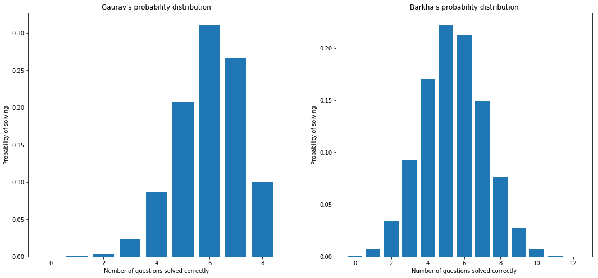
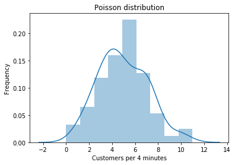
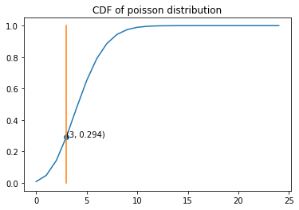
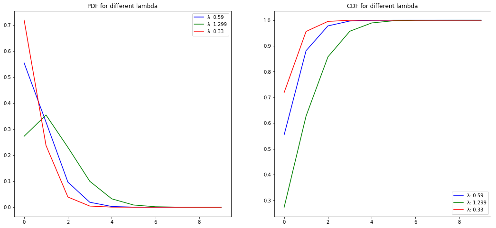

<h3> Calculate the mean, median, mode and standard deviation for the problem
statements 1& 2.</h3>

# Problem Statement 1:

The marks awarded for an assignment set for a Year 8 class of 20 students were as
follows:
    
6 7 5 7 7 8 7 6 9 7 4 10 6 8 8 9 5 6 4 8

$\text{Formula for mean is} \frac{1}{n}\sum_{i=1}^{n} i$

$\text{Formula for median is:} \frac{n+1}{2}^{th} \text{ term if number of observation is }\textbf{odd}\text{ and}\\
                              \frac{1}{2}(\frac{n}{2}^{th}+\frac{n+1}{2}^{th})\text{ term if number of observation is} \textbf{ even.}$
                              
$\text{A number that appears most often is the}\textbf{ mode.}$

$\text{Formula for standard deviation is }=\sqrt{\frac{1}{N}\sum_{i=1}^N(x_i-\bar{x})^2}$

$\text{Formula for mean here is} \sum_{i=1}^{20} i$

$\text{ where i is in the dataset {6, 7, 5, 7, 7, 8, 7, 6, 9, 7, 4, 10, 6, 8, 8, 9, 5, 6, 4, 8}}$


```python
import numpy as np
from scipy import stats
import statistics
# problem statement 1
a =[6, 7, 5, 7, 7, 8, 7, 6, 9, 7, 4, 10, 6, 8, 8, 9, 5, 6, 4, 8]
mean = np.mean(a)
median = np.median(a)
mode = stats.mode(a)
std_dev = statistics.stdev(a)
print('mean is ',mean)
print('median is ',median)
print('mode is ',mode)
print('Standard Deviation is', std_dev)
```

    mean is  6.85
    median is  7.0
    mode is  ModeResult(mode=array([7]), count=array([5]))
    Standard Deviation is 1.6311119875071343


# Problem Statement 2:

The number of calls from motorists per day for roadside service was recorded for a
particular month:
    
28, 122, 217, 130, 120, 86, 80, 90, 140, 120, 70, 40, 145, 113, 90, 68, 174, 194, 170,
100, 75, 104, 97, 75,
123, 100, 75, 104, 97, 75, 123, 100, 89, 120, 109

$\text{Formula for mean is} \frac{1}{n}\sum_{i=1}^{n} i$

$\text{Formula for median is:} \frac{n+1}{2}^{th} \text{ term if number of observation is }\textbf{odd}\text{ and}\\
                              \frac{1}{2}(\frac{n}{2}^{th}+\frac{n+1}{2}^{th})\text{ term if number of observation is} \textbf{ even.}$
                              
$\text{A number that appears most often is the}\textbf{ mode.}$

$\text{Formula for standard deviation is }=\sqrt{\frac{1}{N}\sum_{i=1}^N(x_i-\bar{x})^2}$

$\text{Formula for mean here is} \sum_{i=1}^{n} i$
$\text{ where i is in the dataset}$
$\text{{28, 122, 217, 130, 120, 86, 80, 90, 140, 120, 70, 40, 145,
113, 90, 68, 174, 194, 170, 100, 75, 104, 97, 75, 123, 100, 75, 104, 97, 75, 123, 100, 89, 120, 109}}$


```python
# problem statement 2
b = [28, 122, 217, 130, 120, 86, 80, 90, 140, 120, 70, 40, 145, 113, 90, 68, 174, 194, 170,
100, 75, 104, 97, 75,
123, 100, 75, 104, 97, 75, 123, 100, 89, 120, 109]
mean = np.mean(b)
median = np.median(b)
mode = stats.mode(b)
std_dev = statistics.stdev(a)
print('mean is ',mean)
print('median is ',median)
print('mode is ',mode)
print('Standard Deviation is', std_dev)
```

    mean is  107.51428571428572
    median is  100.0
    mode is  ModeResult(mode=array([75]), count=array([4]))
    Standard Deviation is 1.6311119875071343


# Problem Statement 3:

The number of times I go to the gym in weekdays, are given below along with its
associated probability:
    
x = 0, 1, 2, 3, 4, 5

f(x) = 0.09, 0.15, 0.40, 0.25, 0.10, 0.01

Calculate the mean no. of workouts in a week. Also evaluate the variance involved in
it.

$\text{Formula for mean is:} \sum_{i=1}^{n} x_{i}*f(x_{i})$

$\text{Formula for variance is:} \sum_{i=1}^{n} (Mean - x_{i})^{2}*f(x_{i})$

$\text{Formula for standard deviation:} \sqrt{Variance}$


```python
# problem statement 3
x = [0, 1, 2, 3, 4, 5]
fx = [0.09, 0.15, 0.40, 0.25, 0.10, 0.01]
mean = sum([float(x[i])*fx[i] for i in range(len(x))])
variance = (sum([float(x[i]**2)*fx[i] for i in range(len(x))])-mean)
print('mean is',mean)
print('Variance is', variance)
```

    mean is 2.15
    Variance is 3.6999999999999997


# Problem Statement 4:

Let the continuous random variable D denote the diameter of the hole drilled in an
aluminum sheet. The target diameter to be achieved is 12.5mm. Random
disturbances in the process often result in inaccuracy.Historical data shows that the distribution of D can be modelled by the PDF (d) =
20e−20(d−12.5), d ≥ 12.5. If a part with diameter > 12.6 mm needs to be scrapped,what is the proportion of those parts? What is the CDF when the diameter is of 11
mm? What is your conclusion regarding the proportion of scraps?

$\text{Proportion that a part with diameter > 12.5mm needs to be scraped is:}$

$\begin{equation}
P(X>12.6)= \int_{12.6}^{\infty} 20e^{-20(x-12.5)} dx = \left[-e^{-20(x-12.5)}\right]_{12.6}^{\infty} = 0.135
\end{equation}$


$\text{CDF when diameter is 11mm is 0 since the PDF function is only applicable when d>=12.5 .}$

$\text{For proportion of scraps: P(12.5 < X < x) that is proportion that a particular diameter x lies between X ans 12.5}$

$\text{F(x) = 0 for x < 12.5}$

$\begin{equation} F(x)= \int_{12.5}^x 20e^{-20(u-12.5)} du = 1 - e^{-20(x-12.5)} \text{for x>= 12.5} \end{equation}$

$\begin{equation}
  F(x)=
    0, \text{if $x<12.5$ and }  1-e^{-20(x-12.5)}, \text{for x>=12.5}\end{equation}$
 
  $\text{where F(x) is P(12.5 < X < x)}$

<h3>Conclusion </h3>
<p>For any value of diameter less than 12.5 mm, the proportion of scraps is zero. For any value above 12.5 mm the proportion of scraps follow the equation: </p> $1-e^{-20(x-12.5)}$

# Problem Statement 5:

A company manufactures LED bulbs with a faulty rate of 30%. If I randomly select 6
chosen LEDs, what is the probability of having 2 faulty LEDs in my sample?
Calculate the average value of this process. Also evaluate the standard deviation
associated with it.

$\text{Let x be the faulty LEDs which is 2. Here n is 6 and p is 0.3(success i.e. faulty).}$
$\text{The probability that 2 will be faulty is:}$
$\text{P(X) = }$ ${n \choose x}{p^x}{q^{n-x}} = {6 \choose 2}{(0.3)^2}{(0.7)^{6-2}}$
=15 * 0.09 * 0.2401 = 0.3241

$\text{Standard Deviation formula for binomial distribution is: } \sqrt{n * p * (1-p)}$


```python
#problem statement 5
from scipy.stats import binom
add = sum(np.random.binomial(6, 0.3, 50000) == 2)/50000
print(add)
n = 6
p = 0.3
mean , var = binom.stats(n, p)
std = var**0.5
print('Mean is',mean)
print('Standard deviation for this process is',std)
```

    0.3257
    Mean is 1.7999999999999998
    Standard deviation for this process is 1.1224972160321822


# Problem Statement 6:

Gaurav and Barakha are both preparing for entrance exams. Gaurav attempts to
solve 8 questions per day with a correction rate of 75%, while Barakha averages
around 12 questions per day with a correction rate of 45%. What is the probability
that each of them will solve 5 questions correctly? What happens in cases of 4 and 6
correct solutions? What do you infer from it? What are the two main governing
factors affecting their ability to solve questions correctly? Give a pictorial
representation of the same to validate your answer.

$\text{For Gaurav:}$

$\text{Let x be the number of questions to solve 5. Number of questions he solves(n) is 8.}$

$\text{Probability(p) i.e. the correction rate is 0.75.}$
$\text{P(X) = } {n \choose x}{p^x}{q^{n-x}} =  {8 \choose 5}{(0.75)^5}{(0.25)^{8-5}}$

$\text{=56 * 0.2373 * 0.015625 = 0.2076}$

$\text{For Barkha:}
\\
\text{Let x be the number of questions to solve 5. Number of questions she solves(n) is 12.}$
$\text{Probability(p) i.e. the correction rate is 0.45.}$
$\text{P(X) = } {n \choose x}{p^x}{q^{n-x}} = {12 \choose 5}{(0.45)^5}{(0.55)^{12-5}}$

$\text{ =792 * 0.0185 * 0.015 = 0.223}$


```python
from scipy.stats import binom 
import matplotlib.pyplot as plt 
# setting the values of n and p  
n_Gaurav = 8
p_Gaurav = 0.75
n_Barkha = 12
p_Barkha = 0.45
# defining list of r values 
r_values_Gaurav = list(range(n_Gaurav + 1)) 
r_values_Barkha = list(range(n_Barkha + 1)) 
# list of pmf values 
dist_Gaurav = [binom.pmf(r, n_Gaurav, p_Gaurav) for r in r_values_Gaurav]
dist_Barkha = [binom.pmf(r, n_Barkha, p_Barkha) for r in r_values_Barkha ]
# plotting the graph  
fig = plt.figure(figsize=(18,8))
plt.subplot(1, 2, 1)
plt.title('Gaurav\'s probability distribution')
plt.xlabel('Number of questions solved correctly')
plt.ylabel('Probability of solving')
plt.bar(r_values_Gaurav, dist_Gaurav)
plt.subplot(1, 2, 2)
plt.title('Barkha\'s probability distribution')
plt.xlabel('Number of questions solved correctly')
plt.ylabel('Probability of solving')
plt.bar(r_values_Barkha, dist_Barkha) 
plt.show()
```





```python
print('Probability to solve',r_values_Barkha[4],'correctly for Barkha is', dist_Barkha[4])
print('Probability to solve',r_values_Gaurav[4],'correctly for Gaurav is', dist_Gaurav[4])
print('Probability to solve',r_values_Barkha[6],'correctly for Barkha is', dist_Barkha[6])
print('Probability to solve',r_values_Gaurav[6],'correctly for Gaurav is', dist_Gaurav[6])
```

    Probability to solve 4 correctly for Barkha is 0.1699639321360581
    Probability to solve 4 correctly for Gaurav is 0.08651733398437506
    Probability to solve 6 correctly for Barkha is 0.21238468214026432
    Probability to solve 6 correctly for Gaurav is 0.31146240234375017


<p> The two main factors affecting the ability to solve questions correctly are:</p>
<li>Correction rate</li>
<li>Number of questions solved per day</li>

<p>As the correction rate increases the chances of the distribution to be left skewed increases. Since Barkha's correction rate is close to 0.5 so highest probability of solving questions is found at around 50% of the total number of questions.</p>
<p>Increasing the number of questions solved daily reduces skewness as well.As the number of questions increases the distribution skewness decreases</p>  

# Problem Statement 7:

Customers arrive at a rate of 72 per hour to my shop. What is the probability of k
customers arriving in 4 minutes? a) 5 customers, b) not more than 3 customers, c)
more than 3 customers. Give a pictorial representation of the same to validate your
answer.

$\text{Formula for poisson's distribution is:}$
$\begin{equation}
P(x) = \frac{e^{-\lambda}{\lambda}^x}{x!}
\end{equation}$

a\) $\text{Per four minutes the average number of customers is (72/60)*4 which is 4.8.
So } {\lambda} \text{ is 4.8.}$

$\text{We need to find the probability for 5 customers in 4 minutes. So x is 5. }$
$\text{Substituting the values to formula we get:}$
$\begin{equation}
P(x) = \frac{e^{-4.8}{4.8}^5}{5!} = \frac{0.00823 * 2548.04}{120} = 0.175
\end{equation}$

b\) $\text{Per four minutes the average number of customers is (72/60)*4 which is 4.8.
So } {\lambda} \text{ is 4.8.}$

$\text{We need to find the probability for not more than 3 customers in 4 minutes. So x is 0, 1, 2, 3. }$
$\text{Substituting the values to formula we get:}$
$P(x_{0})+P(x_{1})+P(x_{2})+P(x_{3})$

$= \frac{e^{-4.8}{4.8}^0}{0!}+ \frac{e^{-4.8}{4.8}^1}{1!}+\frac{e^{-4.8}{4.8}^2}{2!}+\frac{e^{-4.8}{4.8}^3}{3!}$

$= \frac{0.00823 * 1}{1}+\frac{0.00823 * 4.8}{1}+\frac{0.00823 * 23.04}{2}+\frac{0.00823 * 110.59}{6}$

$\text{= 0.00823+0.0395+0.095+0.152}$

$\text{= 0.2944}$

c\) $\text{More than 3 customers is:}$

$\begin{equation}:
1 - P(x_{0})+P(x_{1})+P(x_{2})+P(x_{3}) = 1 - 0.2944 = 0.706
\end{equation}$


```python
from scipy.stats import poisson
import seaborn as sb
data_binom = poisson.rvs(mu=4.8, size=200)

ax = sb.distplot(data_binom)
ax.set(xlabel='Customers per 4 minutes', ylabel='Frequency')
plt.title('Poisson distribution')
plt.show()
```

    /home/naman/.local/share/canopy/edm/envs/User/lib/python3.5/site-packages/scipy/stats/stats.py:1713: FutureWarning: Using a non-tuple sequence for multidimensional indexing is deprecated; use `arr[tuple(seq)]` instead of `arr[seq]`. In the future this will be interpreted as an array index, `arr[np.array(seq)]`, which will result either in an error or a different result.
      return np.add.reduce(sorted[indexer] * weights, axis=axis) / sumval





```python
import numpy as np
x = np.arange(0,25)
prob = poisson.cdf(x, 4.8)
y = prob[3]
print('Probability of not more than 3 customers is',round(y,3))
print('Probability of more than 3 customers is',round((1 - y),3))
plt.plot(prob)
plt.plot((3,3),(0,1))
plt.scatter(3,prob[3])
plt.text(3,prob[3],'({}, {})'.format(3, round(prob[3],3)))
plt.title('CDF of poisson distribution')
plt.show()
```

    Probability of not more than 3 customers is 0.294
    Probability of more than 3 customers is 0.706





# Problem Statement 8:

I work as a data analyst in Aeon Learning Pvt. Ltd. After analyzing data, I make
reports, where I have the efficiency of entering 77 words per minute with 6 errors per
hour. What is the probability that I will commit 2 errors in a 455-word financial report?
What happens when the no. of words increases/decreases (in case of 1000 words,
255 words)?
How is the λ affected?
How does it influence the PMF?
Give a pictorial representation of the same to validate your answer.

$\text{Formula for poisson's distribution is:}$
$\begin{equation}
P(x) = \frac{e^{-\lambda}{\lambda}^x}{x!}
\end{equation}$

$\text{77 words per minute has 6 errors per hour that is 0.1 errorr per minute. }$

$\text{So a 455 word report will have an average of 0.59 errors. So }{\lambda} 
\text{ is 0.59. We need probability of 2 errors. Hence x is 2.}
$
$\text{Substituting the values to formula we get:}$

$\begin{equation}
P(x) = \frac{e^{-0.59}{0.59}^2}{2!} = \frac{0.5543 * 0.3481}{2} = 0.0965
\end{equation}$

$\text{77 words per minute has 6 errors per hour that is 0.1 errorr per minute. }$

$\text{So a 1000 word report will have an average of 1.299 errors. So }{\lambda} 
\text{ is 1.299. We need probability of 2 errors. Hence x is 2.}
$
$\text{Substituting the values to formula we get:}$

$\begin{equation}
P(x) = \frac{e^{-1.299}{1.299}^2}{2!} = \frac{0.2728 * 1.6874}{2} = 0.23
\end{equation}$

$\text{77 words per minute has 6 errors per hour that is 0.1 errorr per minute. }$

$\text{So a 255 word report will have an average of 0.33 errors. So }{\lambda} 
\text{ is 0.33. We need probability of 2 errors. Hence x is 2.}
$
$\text{Substituting the values to formula we get:}$

$\begin{equation}
P(x) = \frac{e^{-0.33}{0.33}^2}{2!} = \frac{0.7189 * 0.1089}{2} = 0.04
\end{equation}$

$\text{As the number of words in report increase } {\lambda} \text{ that is the expected rate of errors increase.}$


```python
fig = plt.figure(figsize=(18, 8))
x = np.arange(0,10)
mu_1 = 0.59
mu_2 = 1.299
mu_3 = 0.33
plt.subplot(1,2,1)
plt.plot(x, poisson.pmf(x, mu_1), 'b-', label='λ: 0.59')
plt.plot(x, poisson.pmf(x, mu_2), 'g-', label='λ: 1.299')
plt.plot(x, poisson.pmf(x, mu_3), 'r-', label='λ: 0.33')
plt.legend()
plt.title('PDF for different lambda')
plt.subplot(1, 2, 2)
x = np.arange(0,10)
mu_1 = 0.59
mu_2 = 1.299
mu_3 = 0.33
plt.plot(x, poisson.cdf(x, mu_1), 'b-',label='λ: 0.59')
plt.plot(x, poisson.cdf(x, mu_2), 'g-', label='λ: 1.299')
plt.plot(x, poisson.cdf(x, mu_3), 'r-', label='λ: 0.33')
plt.legend()
plt.title('CDF for different lambda')
plt.show()
```





On changing lambda the pmf becomes more spread with decreasing peak

# Problem Statement 9:

Let the continuous random variable D denote the diameter of the hole drilled in an
aluminum sheet. The target diameter to be achieved is 12.5mm. Random
disturbances in the process often result in inaccuracy.
Historical data shows that the distribution of D can be modelled by the PDF, f(d) =
20e−20(d−12.5), d ≥ 12.5. If a part with diameter > 12.6 mm needs to be scrapped,
what is the proportion of those parts? What is the CDF when the diameter is of 11
mm?
What is the conclusion of this experiment?

$\text{Proportion that a part with diameter > 12.5mm needs to be scraped is:}$

$\begin{equation}
P(X>12.6)= \int_{12.6}^{\infty} 20e^{-20(x-12.5)} dx = \left[-e^{-20(x-12.5)}\right]_{12.6}^{\infty} = 0.135
\end{equation}$


$\text{CDF when diameter is 11mm is 0 since the PDF function is only applicable when d>=12.5 .}$

$\text{For proportion of scraps: P(12.5 < X < x) that is proportion that a particular diameter x lies between X ans 12.5}$

$\text{F(x) = 0 for x < 12.5}$

$\begin{equation} F(x)= \int_{12.5}^x 20e^{-20(u-12.5)} du = 1 - e^{-20(x-12.5)} \text{for x>= 12.5} \end{equation}$

$\begin{equation}
  F(x)= 0, \text{if $x<12.5$ and }1-e^{-20(x-12.5)} \text{ for x>=12.5}.
  \text{where F(x) is P(12.5 < X < x)}
\end{equation}$
<h3>Conclusion </h3>
<p>For any value of diameter less than 12.5 mm, the proportion of scraps is zero. For any value above 12.5 mm the proportion of scraps follow the equation: </p> $1-e^{-20(x-12.5)}$

# Problem Statement 10:

Please compute the following:
a) P(Z > 1.26), . P(Z < −0.86), P(Z > −1.37), P(−1.25 < Z < 0.37), . P(Z ≤ −4.6)
b) Find the value z such that P(Z > z) = 0.05
c) Find the value of z such that P(−z < Z < z) = 0.99

Using standard normal distriution tables to find the values,

a\) $
\text{P(Z > 1.26) = 1 - P(Z < 1.26) = 1 - 0.896 = 0.104}$

$\text{P(Z < -0.86) = 0.195}$

$\text{P(Z > -1.37) =1 - P(Z < -1.37) = 1 - 0.085 = 0.915}$

$\text{P(-1.25 < Z < 0.37) = P(Z < 0.37) - P(Z < -1.25) = 0.644 - 0.106 = 0.538}$

$\text{P(Z <= -4.6) = 0}$

b\)$
\text{
P(Z > z) = 0.05}$

$\text{P(Z < z) = 1-0.05 = 0.95}$
${\implies} \text{z = 1.64}$

c\) $\text{P(-z < Z < z) = 0.99}$
$\text{P(Z < z) - P(Z < -z) = 0.99}$

$\text{ Total probability is 1}$
    
$\text{So, } 1 - 0.99 = 0.01$
$0.01/2 = 0.005$

$P(Z < z)= 0.005$

${\implies} z = -2.58$

$\text{So, }
    -2.58 < Z < 2.58$
# Problem Statement 11:

The current flow in a copper wire follow a normal distribution with a mean of 10 mA
and a variance of 4 (mA)2.
What is the probability that a current measurement will exceed 13 mA? What is the
probability that a current measurement is between 9 and 11mA? Determine the
current measurement which has a probability of 0.98.

$\text{Mean current is 10 mA}$

$\text{Variance is 4 mA}$

$\text{Standard deviation is $4^{\frac{1}{2}}$ = $2$ mA}$

$\text{Z-score for 13 mA current is}  \frac{13-10}{2} = 1.5$

$\text{We need to find P(Z > z)= P(Z > 1.5) = 1 - P(Z < 1.5)}$

$\text{Using tables, we find that P(Z < 1.5) is 0.933. So probability of P(Z > 1.5) is 1 - 0.933 = 0.067.}$

$\text{Probability that a current exceeding 13 mA will flow is 0.33}$

$\text{Z-score for 9 mA current is}  \frac{9-10}{2} = -0.5$

$\text{Z-score for 11 mA current is}  \frac{11-10}{2} = 0.5$
 
$\text{We need to find P(-0.5< Z < 0.5)}$

$= P(Z < 0.5) - P(Z < -0.5) = 0.691 - 0.309 = 0.382 \approx 0.38$

$\text{P(Z < z) = 0.98}$

$\text{We need to find z.}$

$\text{Using tables, z comes around 2.05}$

$\text{z =} \frac{x-\mu}{\sigma}$ 
${\implies} x = z*{\sigma} + {\mu}$

$\text{Z-Score is 2.05, x(current equivalent of z) is:}$
$2.05*2 + 10 = 4.1 + 10 = 14.1 mA$


# Problem Statement 12:

The shaft in a piston has its diameter normally distributed with a mean of 0.2508 inch
and a standard deviation of 0.0005 inch. The specifications of the shaft are 0.2500 ∓
0.0015 inch. What proportion of shafts are in sync with the specifications? If the
process is centered so that the mean is equal to the target value of 0.2500, what
proportion of shafts conform to the new specifications? What is your conclusion from
this experiment?

$\text{Mean diameter is 0.2508 inch}$

$\text{Standard deviation is 0.0005 inch}$

$\text{Z-score for (0.2500 - 0.0015) 0.2485 is } \frac{0.2485-0.2508}{0.0005} = -4.6$

$\text{Z-score for (0.2500 + 0.0015) 0.2515 is} \frac{0.2515-0.2508}{0.0005} = 1.4$

$\text{We need to find P(-4.6< Z < 1.4)}$

$= P(Z < 1.4) - P(Z < -4.6) =  0.92.$

$\text{So, 0.92 of the shafts are in sync}$

$\text{If mean is 0.2500 then, }
\text{Z-score for (0.2500 - 0.0015) 0.2485 is } \frac{0.2485-0.2500}{0.0005} = -3$

$\text{Z-score for (0.2500 + 0.0015) 0.2515 is} \frac{0.2515-0.2500}{0.0005} = 3$

$\text{We need to find P(-3< Z < 3)}$

$= P(Z < 3) - P(Z < -3) = 0.9973.$

$\text{So, 0.997 of the shafts are in sync}$

<h3>Conclusion</h3>
<p>So if we change the mean from 0.2508 to 0.2500 the proportion of shaft increases from 92% to 99.73% </p>
